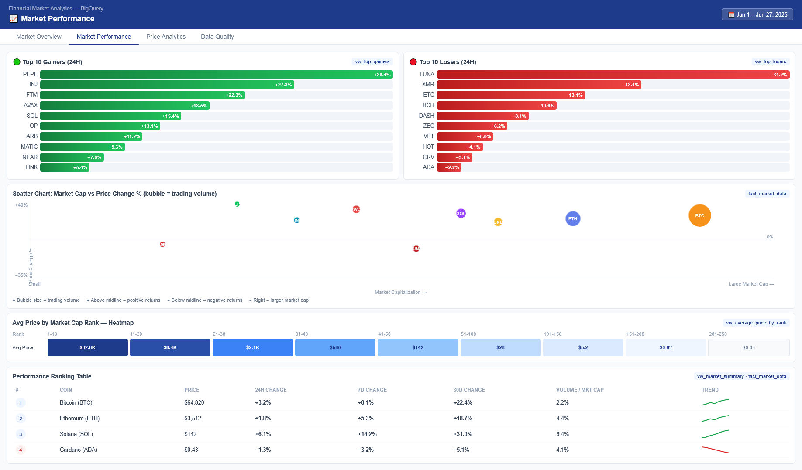
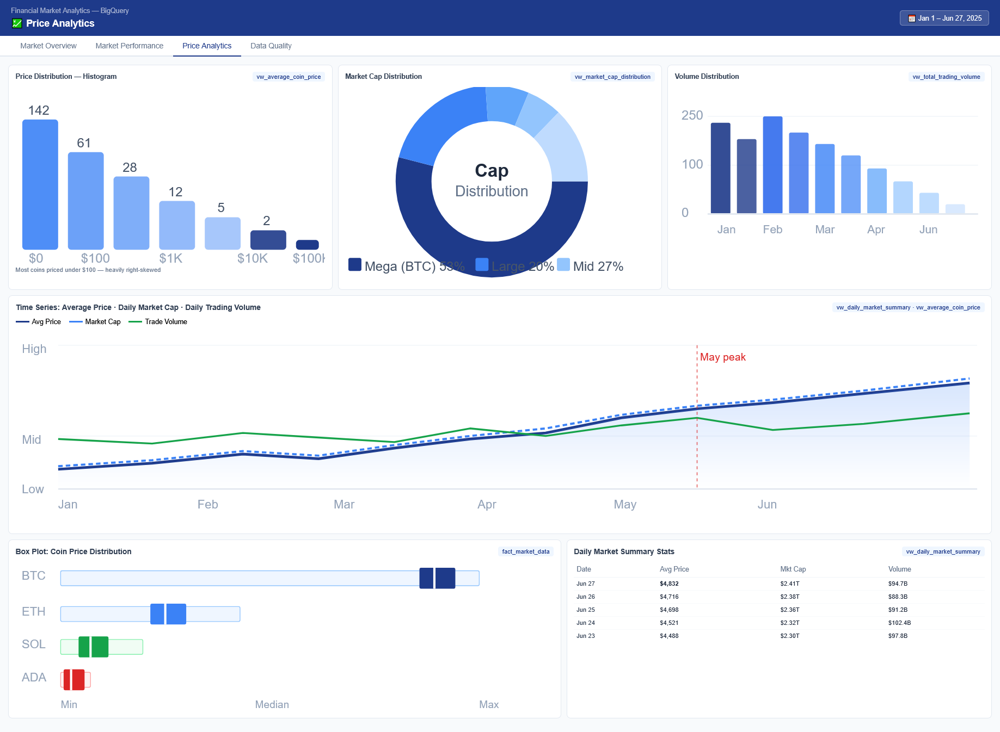
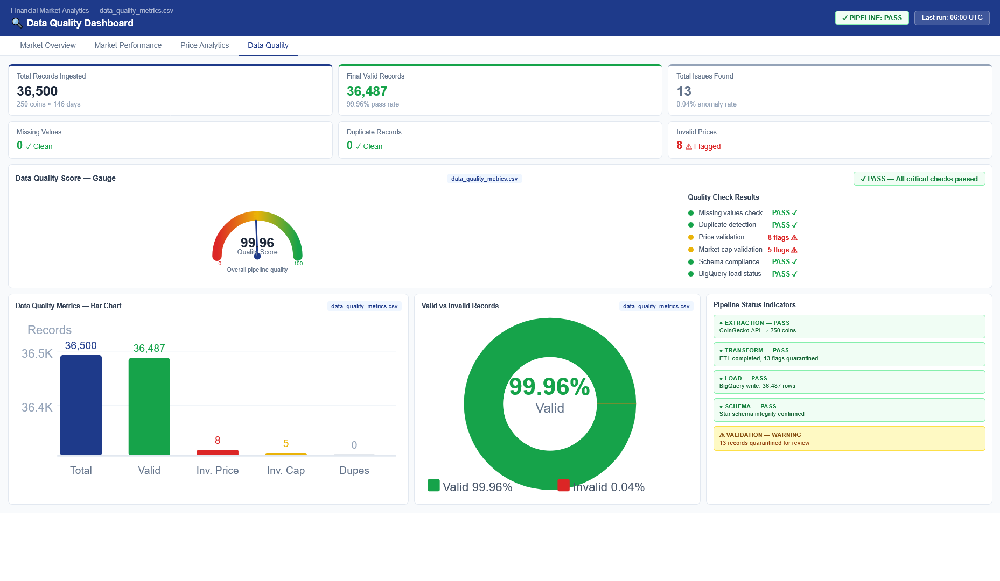

# 🚀 Financial Market Data Pipeline & Analytics Warehouse


An end-to-end **Data Engineering** project that builds a production-style cryptocurrency analytics platform using the **CoinGecko API**, **Python**, **Google BigQuery**, **Star Schema**, **SQL Analytics**, and **Looker Studio**.

---

# 📌 Project Overview

Financial market data changes every second and is commonly consumed by analysts, traders, and business intelligence teams.

This project demonstrates how a Data Engineer builds a complete analytics pipeline by:

- Extracting cryptocurrency market data from the CoinGecko REST API
- Processing and validating JSON data
- Building a modular ETL pipeline in Python
- Monitoring data quality
- Loading data into Google BigQuery
- Designing a Star Schema Data Warehouse
- Creating Analytics Views
- Building interactive dashboards in Looker Studio

The project simulates a real-world financial analytics platform suitable for business reporting and executive dashboards.

---

# 🏗 Project Architecture

```text
                     CoinGecko API
                           │
                           ▼
                  Python Extract Layer
                           │
                           ▼
                   Raw JSON Storage
                           │
                           ▼
                 Data Transformation
                           │
                           ▼
              Data Quality Validation
                           │
                           ▼
                Google BigQuery (Raw)
                           │
                           ▼
               Star Schema Data Warehouse
        ┌──────────────────┴──────────────────┐
        │                                     │
        ▼                                     ▼
    dim_coin                            dim_date
                └──────────┬──────────┘
                           ▼
                 fact_market_data
                           │
                           ▼
                  Analytics Views
                           │
                           ▼
               Looker Studio Dashboard
```

---

# 📊 Dashboard Preview

## Market Overview


---

## Market Performance



---

## Price Analytics



---

## Data Quality Dashboard



---

# 🎯 Business Problem

Organizations need reliable and scalable pipelines to continuously collect market data from external APIs.

Without proper engineering practices:

- Data quality issues become difficult to detect
- Analytics become inconsistent
- Dashboard performance decreases
- Historical reporting becomes unreliable

This project addresses those challenges by implementing a complete Data Engineering workflow.

---

# ⚙ Technology Stack

## Programming

- Python

## Libraries

- requests
- pandas
- numpy
- python-dotenv
- google-cloud-bigquery
- logging

## Cloud

- Google BigQuery

## Visualization

- Looker Studio

## Development

- Git
- GitHub
- VS Code

---

# 📁 Project Structure

```text
financial-market-data-pipeline/


├── credentials/
│
├── dashboard/
│   ├── market_overview.png
│   ├── market_performance.png
│   ├── price_analytics.png
│   └── data_quality.png
├── data/
│   ├── raw/
│   ├── processed/
│   └── reports/
│
├── logs/
│
├── scripts/
│   ├── config.py
│   ├── extract_api.py
│   ├── transform.py
│   ├── data_quality.py
│   └── load_bigquery.py
│
├── sql/
│   ├── star_schema.sql
│   ├── analytics_views.sql
│   └── analytical_queries.sql
│
├── requirements.txt
├── .env.example
├── .gitignore
└── README.md
```

---

# 🔄 ETL Pipeline

## Extract

Source:

CoinGecko REST API

Endpoint:

```
https://api.coingecko.com/api/v3/coins/markets
```

Features:

- Retry mechanism
- Timeout handling
- Logging
- Raw JSON storage

Output:

```
data/raw/market_data.json
```

---

## Transform

Data transformation includes:

- JSON parsing
- Data type conversion
- Missing value handling
- Duplicate removal
- Standardized columns
- Extraction date generation

Output:

```
market_data_clean.csv
```

---

## Data Quality Monitoring

Quality checks include:

- Total Records
- Missing Values
- Duplicate Records
- Null Percentage
- Invalid Prices
- Invalid Market Caps
- Final Valid Records

Reports generated:

```
data_quality_report.txt

data_quality_metrics.csv
```

---

## Load

The processed dataset is loaded into Google BigQuery.

Raw Table:

```
market_raw
```

---

# ⭐ Star Schema Design

## Dimension Tables

### dim_coin

| Column |
|----------|
| coin_id |
| symbol |
| coin_name |
| market_cap_rank |

---

### dim_date

| Column |
|----------|
| date |
| year |
| month |
| month_name |
| quarter |

---

## Fact Table

### fact_market_data

| Column |
|----------|
| coin_id |
| date |
| current_price |
| market_cap |
| total_volume |
| high_24h |
| low_24h |
| price_change_percentage_24h |

---

# 📈 Analytics Views

The project includes reusable analytics views:

- vw_market_summary
- vw_total_market_cap
- vw_total_trading_volume
- vw_average_coin_price
- vw_top_market_cap
- vw_top_trading_volume
- vw_top_gainers
- vw_top_losers
- vw_average_price_by_rank
- vw_market_cap_distribution
- vw_daily_market_summary

These views serve as the semantic layer for Looker Studio dashboards.

---

# 📊 Business Analytics

Example business questions answered:

- What is the total cryptocurrency market capitalization?
- Which coins have the highest market capitalization?
- Which assets have the highest trading volume?
- Who are the top gainers and losers?
- How is market capitalization distributed?
- What is the average coin price by market cap rank?
- How does the market change over time?

---

# 📈 Dashboard Features

### Page 1

Market Overview

- Total Market Cap
- Total Trading Volume
- Average Coin Price
- Total Coins
- Top Market Cap
- Top Trading Volume
- Treemap

---

### Page 2

Market Performance

- Top Gainers
- Top Losers
- Scatter Plot
- Heatmap
- Performance Ranking

---

### Page 3

Price Analytics

- Histogram
- Market Cap Distribution
- Volume Distribution
- Time Series
- Box Plot

---

### Page 4

Data Quality Dashboard

- Quality Score
- Missing Values
- Duplicate Records
- Invalid Prices
- Pipeline Status
- Validation Summary

---

# 💡 Key Skills Demonstrated

- REST API Integration
- JSON Processing
- ETL Pipeline Development
- Data Validation
- Data Quality Monitoring
- Cloud Data Warehousing
- Google BigQuery
- Star Schema Modeling
- SQL Analytics
- Data Visualization
- Dashboard Development
- Git Version Control

---

# 🚀 Future Improvements

- Apache Airflow orchestration
- Incremental data loading
- Historical market snapshots
- Docker containerization
- CI/CD pipeline
- Unit testing
- Automated scheduling
- Real-time streaming pipeline

---

# ▶️ How to Run

Clone the repository

```bash
git clone https://github.com/BAGASSETIADI/financial-market-data-pipeline.git
```

Move into the project

```bash
cd financial-market-data-pipeline
```

Install dependencies

```bash
pip install -r requirements.txt
```

Configure environment variables

```text
PROJECT_ID=your-project-id

DATASET_ID=market_analytics

GOOGLE_APPLICATION_CREDENTIALS=credentials/service-account.json
```

Run the pipeline

```bash
python scripts/extract_api.py

python scripts/transform.py

python scripts/data_quality.py

python scripts/load_bigquery.py
```

---

# 📄 License

This project is released under the MIT License.

---

# 👨‍💻 Author

**Bagas Setiadi**

- LinkedIn: https://www.linkedin.com/in/bagas-setiadi/
- GitHub: https://github.com/BAGASSETIADI
- Portfolio: https://bagas54.my.id

---

⭐ If you found this project useful, feel free to give it a star!
